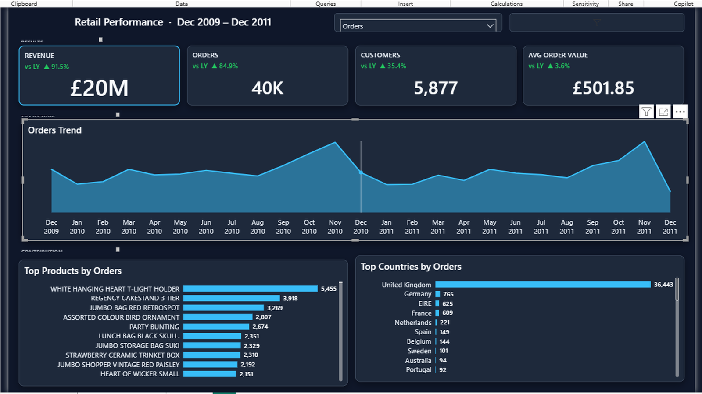
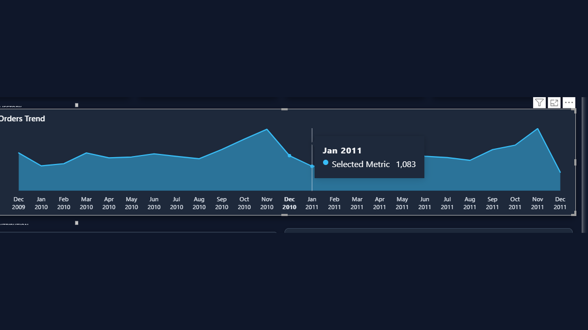
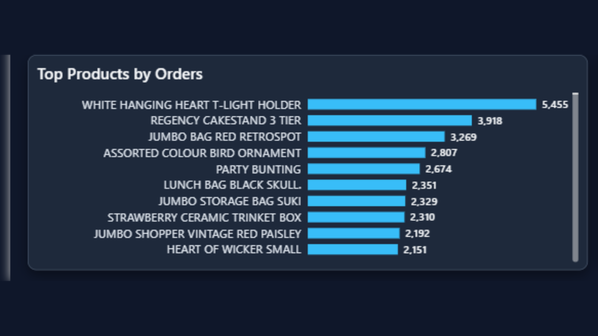
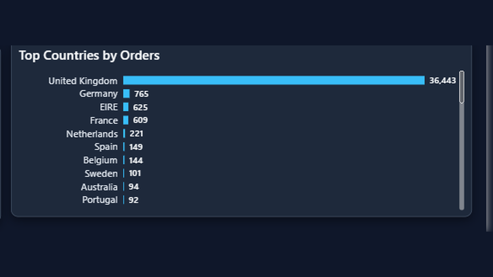

# Retail Executive Dashboard

Analysis of a UK online retailer (Online Retail II, Dec 2009 – Dec 2011). Revenue, orders, customers, and market mix are reviewed together so commercial leads can see how the business is performing and where it is coming from.

**Walkthrough:** [`artifacts/retail-executive-dashboard-demo.mp4`](./artifacts/retail-executive-dashboard-demo.mp4)


---

## Business Problem

The source file is a line-level sales extract. Useful for ops, hard for leadership.

Problems it created:

- No single view of revenue, orders, customers, and AOV
- Product and country performance buried in thousands of invoice rows
- Guest checkouts, cancellations, and fee codes mixed with real sales
- No easy way to answer: *how are we doing, and where is it coming from?*

---

## Dashboard Overview

An interactive executive dashboard for commercial review. KPI cards stay on screen while trend and ranking views switch between revenue, orders, customers, and AOV.

Period covered: **Dec 2009 – Dec 2011**

---

## Key Metrics

| KPI | Value | vs last year |
|---|---|---|
| Revenue | **£20M** | **+91.5%** |
| Orders | **40K** | **+84.9%** |
| Customers | **5,877** | **+35.4%** |
| Avg order value | **£501.85** | **+3.6%** |

Independent Python / SQL reconciliation on the same filters lands near **£19.7M** revenue, **~39.6K** orders, **~5.9K** customers — in line with the dashboard cards.

---

## Dashboard Pages

### Executive Dashboard



- Revenue **£20M**, orders **40K**, customers **5,877**, and AOV **£501.85** set the commercial baseline.
- YoY cards show strong growth (**+91.5%** revenue, **+84.9%** orders) with a modest AOV lift (**+3.6%**).
- One screen keeps mix, trend, and rankings available without hopping files.

### Orders Trend



- Clear seasonality: peaks in **November** 2010 and 2011, then a sharp drop into Dec / Jan.
- Tooltip example: **Jan 2011 → 1,083** on the selected metric.
- Axis starts at zero so the chart does not overstate drops.

### Top Products by Orders



| Rank | Product | Orders |
|---|---|---|
| 1 | WHITE HANGING HEART T-LIGHT HOLDER | 5,455 |
| 2 | REGENCY CAKESTAND 3 TIER | 3,918 |
| 3 | JUMBO BAG RED RETROSPOT | 3,269 |
| 4 | ASSORTED COLOUR BIRD ORNAMENT | 2,807 |
| 5 | PARTY BUNTING | 2,674 |

- A small set of SKUs drives a large share of order volume.
- Hero products are a practical list for inventory and promo focus.

### Top Countries by Orders



| Rank | Country | Orders |
|---|---|---|
| 1 | United Kingdom | 36,443 |
| 2 | Germany | 765 |
| 3 | EIRE | 625 |
| 4 | France | 609 |
| 5 | Netherlands | 221 |

- UK concentration is heavy (~**36.4K** orders); export markets are real but much smaller.
- Germany, EIRE, and France are the next markets to watch after the domestic base.

---

## Key Findings

1. One-screen commercial review works when revenue, orders, customers, and AOV share definitions.
2. November holiday peaks are structural in both 2010 and 2011.
3. A short hero-SKU list (hanging heart, cake stand, jumbo bag) drives a large share of orders.
4. UK dominates order volume; export markets matter but are a long tail.
5. Documented cleaning rules (cancels, fees, guests) keep finance and ops on the same numbers.

---

## Analysis Process

- Collected and cleaned the Online Retail II workbook.
- Validated revenue, orders, customers, and AOV definitions.
- Performed exploratory analysis on monthly trends and rankings.
- Investigated product and country concentration.
- Calculated business metrics used in the dashboard.
- Built dashboard visuals for executive commercial review.

---

## Tools Used

- Power BI
- SQL
- Python
- Excel

---

## Repository Structure

```text
data/          cleaned tables (csv / xlsx / parquet)
excel/         dictionary, cleaning log, summary
sql/           KPI and quality queries
notebooks/     analysis notebooks (.ipynb)
dashboard/     Power BI project (.pbip)
screenshots/   dashboard page images
artifacts/     walkthrough video
```

---

## How to View

1. Open `dashboard/RetailExecutiveDashboard.pbip` in Power BI Desktop
2. See [`screenshots/`](./screenshots/)
3. Watch [`artifacts/retail-executive-dashboard-demo.mp4`](./artifacts/retail-executive-dashboard-demo.mp4)

---

## Author

Nishant Tyagi
