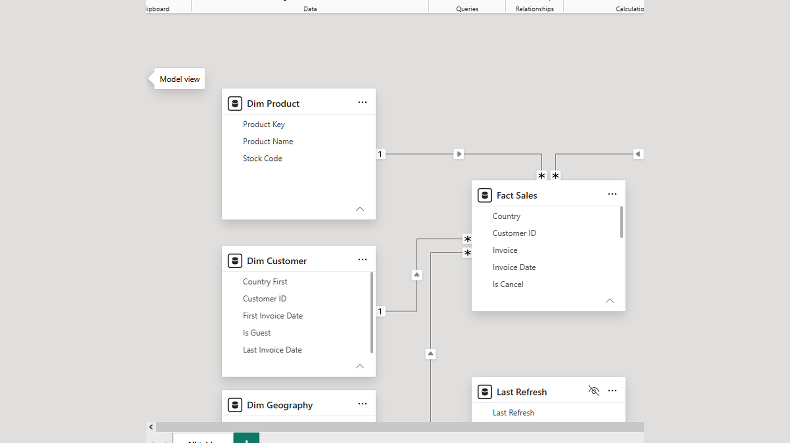

# Retail Executive Dashboard

End-to-end data analyst project for a UK online retailer (Online Retail II, Dec 2009 – Dec 2011): Excel dictionary & cleaning log, Python cleaning/EDA, SQL staging & KPI queries, and a Power BI executive page for revenue, orders, customers, and mix.

**GitHub:** [tnishant082-dev/RetailExecutiveDashboard](https://github.com/tnishant082-dev/RetailExecutiveDashboard)

**Semantic model / report stub:** [`RetailExecutiveDashboard.pbip`](./RetailExecutiveDashboard.pbip) · portfolio visuals in [`screenshots/`](./screenshots/)

---

## Project Overview

Built so a commercial lead can open one page and see revenue, orders, customers, and where the business is coming from — without digging through raw invoice lines.

Source workbook: [`data/online_retail_II.xlsx`](./data/online_retail_II.xlsx)

---

## Business Problem

The source file is a line-level sales extract. Useful for ops, hard for leadership.

Problems it created:

- No single view of **revenue, orders, customers, and AOV**
- Product and country performance buried in thousands of invoice rows
- Guest checkouts, cancellations, and fee codes mixed with real sales
- No easy way to answer: *how are we doing, and where is it coming from?*

---

## End-to-End Workflow

```text
Online Retail II workbook (2 sheets)
        │
        ▼
   Excel  ──►  dictionary, cleaning log, top product / country tables
        │
        ▼
   Python ──►  dedupe, cancel/fee filters, monthly trend charts
        │
        ▼
   SQL    ──►  staging + revenue view, quality checks, KPI queries
        │
        ▼
   Power BI ──► Power Query cleanup, star schema, exec page + YoY
```

| Layer | What it does |
|---|---|
| **Excel** | Field dictionary, cleaning decisions, dashboard KPI / ranking tables |
| **Python** | Combine years, apply revenue rules, exploratory charts |
| **SQL** | Staging DDL, fee-code checks, revenue / trend / ranking queries |
| **Power BI** | Fact Sales + dims, DAX KPIs with vs last year |

---

## Key Metrics

Figures from the live report on the cleaned Online Retail II period (Dec 2009 – Dec 2011), with YoY on the KPI cards:

| KPI | Value | vs last year |
|---|---|---|
| Revenue | **£20M** | **+91.5%** |
| Orders | **40K** | **+84.9%** |
| Customers | **5,877** | **+35.4%** |
| Avg order value | **£501.85** | **+3.6%** |

Independent Python / SQL reconciliation on the same filters lands near **£19.7M** revenue, **~39.6K** orders, **~5.9K** customers — in line with the dashboard cards.

---

## Dashboard Pages

**Retail Performance** (single executive page):

- **Revenue / Orders / Customers / AOV** cards stay on screen (with vs LY)
- Top slicer switches the trend + ranking charts between revenue, orders, customers, and AOV
- Dark theme for a clean exec read

What leadership can do in one screen:

- Spot **November holiday peaks** on the trend (strong seasonality in 2010 and 2011)
- See that a **small set of products** drives a large share of orders
- See that the **UK dominates** order volume (~36K), with Germany / EIRE / France next

---

## Key Insights

### Orders trend

- Clear **seasonality**: peaks in **November** 2010 and 2011, then a sharp drop into Dec / Jan
- Tooltip example: **Jan 2011 → 1,083** on the selected metric
- Axis starts at zero so the chart does not overstate drops

### Top products by orders

| Rank | Product | Orders |
|---|---|---|
| 1 | WHITE HANGING HEART T-LIGHT HOLDER | 5,455 |
| 2 | REGENCY CAKESTAND 3 TIER | 3,918 |
| 3 | JUMBO BAG RED RETROSPOT | 3,269 |
| 4 | ASSORTED COLOUR BIRD ORNAMENT | 2,807 |
| 5 | PARTY BUNTING | 2,674 |
| 6 | LUNCH BAG BLACK SKULL. | 2,351 |
| 7 | JUMBO STORAGE BAG SUKI | 2,329 |
| 8 | STRAWBERRY CERAMIC TRINKET BOX | 2,310 |
| 9 | JUMBO SHOPPER VINTAGE RED PAISLEY | 2,192 |
| 10 | HEART OF WICKER SMALL | 2,151 |

### Top countries by orders

| Rank | Country | Orders |
|---|---|---|
| 1 | United Kingdom | 36,443 |
| 2 | Germany | 765 |
| 3 | EIRE | 625 |
| 4 | France | 609 |
| 5 | Netherlands | 221 |
| 6 | Spain | 149 |
| 7 | Belgium | 144 |
| 8 | Sweden | 101 |
| 9 | Australia | 94 |
| 10 | Portugal | 92 |

Heavy UK concentration — export markets are real but much smaller.

---

## Business Impact

- One-screen commercial review for revenue, orders, customers, and AOV
- Clear hero-SKU list for inventory and promo focus
- Transparent UK vs export mix for channel conversations
- Documented cleaning rules (cancels, fees, guests) so finance and ops share definitions
- Repeatable Excel → Python → SQL → Power BI path when new months arrive

---

## Data Model / Tools

Star schema:

| Table | Role |
|---|---|
| **Fact Sales** | One row per invoice line — qty, price, line amount, dates, cancel / revenue / guest flags |
| **Dim Product** | Product key, stock code, name (surrogate key because stock codes are not unique) |
| **Dim Customer** | Customer id, guest flag, first country, first / last invoice dates |
| **Dim Geography** | Country + simple region |
| **Date** | Marked date table for trend and time intelligence |

Relationships are single-direction, many-to-one, from the fact into each dimension.

**Tools:** Power BI · Power Query · DAX · Python (pandas) · SQL · Excel

---

## Repository Structure

```text
excel/                           # dictionary, cleaning log, summary tables
sql/                             # staging DDL, quality checks, KPI queries
notebooks/                       # cleaning + EDA notebook
python/                          # KPI helper + optional chart outputs
data/                            # online_retail_II.xlsx (+ optional cleaned sample)
RetailExecutiveDashboard.pbip    # Power BI project entry
RetailExecutiveDashboard.Dataset/
RetailExecutiveDashboard.Report/
screenshots/
requirements.txt
README.md
```

---

## How to open / reproduce

1. Clone the repo
2. `pip install -r requirements.txt`
3. Run `notebooks/01_cleaning_eda.ipynb` (workbook load takes a minute)
4. Load invoice lines into `stg_retail_raw` and run `sql/01_create_staging.sql` → `02_quality_checks.sql` → `03_kpi_queries.sql`
5. Open `RetailExecutiveDashboard.pbip` in Power BI Desktop
6. If data does not load, set `pOnlineRetailPath` to `data/online_retail_II.xlsx`

---

## Screenshots

Portfolio report visuals for review — **numbers come from the cleaned Online Retail II pipeline** (`data/`, `sql/`, Python outputs) in this repo. Not a claim that these PNGs are live Power BI Desktop exports.

### Retail Performance


### Data model



### Orders trend


### Top products by orders


### Top countries by orders


---

## Dataset

- **Source:** Online Retail II
- **Period:** Dec 2009 – Dec 2011
- **File in repo:** [`data/online_retail_II.xlsx`](./data/online_retail_II.xlsx)
- Optional sample of cleaned revenue lines: [`data/cleaned_revenue_sample.csv`](./data/cleaned_revenue_sample.csv)

---

## Author

[Nishant Tyagi](https://github.com/tnishant082-dev)
